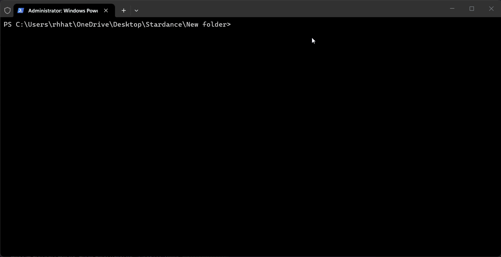
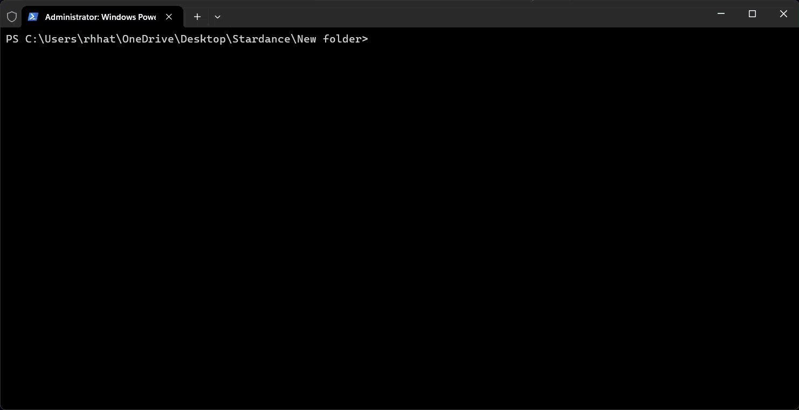

</img>

## Wondered how Iron Man controls his suit and his tech? Well now you know with the tech of *Stark* and the suit of *IRON*


# Live Demo

>>> [Click Here!](https://ironman-themed-webos.vercel.app/)

# Quick Start
if you are techie or a programmer, and want to start a development server to make your own *IRON OS*.

👇Here is the guide

___

```bash
npx serve . 
# npx can only be used when you have node.js
# opens a development server on http://localhost:3000 
```


___

```bash
python -m http.server 8000
# works only with python
# opens a development server on http://localhost:8000
```


___

# Features

- A Welcome window(Just want to brag bout' it😅)

- IronBook stores all your thoughts in one place. Got a plan of attack...No, just attack you don't need to store it, but when it comes to actual thoughts and plan...open Ironbook.

- IronCalc when you can't prove 2 + 2 = 5(Oh it's not😅).

- Time and Workstation Info on top of your screen.

- Thats it!
# Shoutout to HackClub and Blueberry Jam

A big shoutout to Hackclub and Blueberry Jam because without hackclub I couldn't have the even thought that I can make a OS inside HTML. Blueberry Jam gave me the Tutorial of the life(T.O.T.L.).

Big shoutout to @SerenityUX on github, without him there was no way I could got the T.O.T.L

___

*Captain America: Stark we need a Plan of Attack!* <br>
*Tony Stark: I got a plan of attack...Attack*