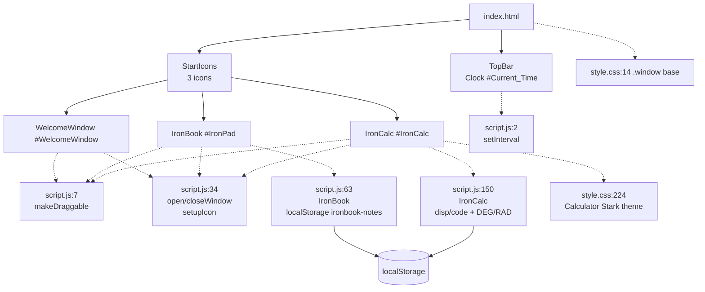

</img>

## An Web based OS with the tech of *Stark* and Power of *IRON*


# Live Demo

>>> [Click Here!](https://ironman-themed-webos.vercel.app/)

# Quick Start
if you are techie or a programmer, and want to start a development server to make your own *IRON OS*.

👇Here is the guide

___

```bash
npx serve . 
# npx can only be used when you have node.js
# opens a development server on http://localhost:3000 
```


___

```bash
python -m http.server 8000
# works only with python
# opens a development server on http://localhost:8000
```


___

# Features

- A Welcome window(Just want to brag bout' it)

- IronBook stores all your thoughts in one place. Got a plan of attack...No, just attack you don't need to store it, but when it comes to actual thoughts and plan...open Ironbook.

- IronCalc when you can't prove 2 + 2 = 5(Oh it's not😅).

- Time and Workstation Info on top of your screen.

- Thats it!

___

# HOW IT WORKS

Static site - no framework, no build. `index.html` = desktop, `style.css` = theme, `script.js` = OS.



# HALL OF ARMOR — CREDITS

| Suit Part | Credit |
|---|---|
| Theme | Iron Man / Stark Industries (Marvel) |
| Fonts | `Orbitron` + `Caacupe One` via Google Fonts (`style.css:1`) |
| Art | `assets/` wallpapers, icons, chibi overlay (`style.css:88` — pngtree, rest artist-unknown) |
| Stack | Vanilla HTML/CSS/JS, zero deps — Vercel deploy, Mermaid diagram |

# Badges

<p align=center>


</p>

___

*Iron Man "Doth mother know you weareth her drapes?"*<br>
*Thor(Point Break) ...*
